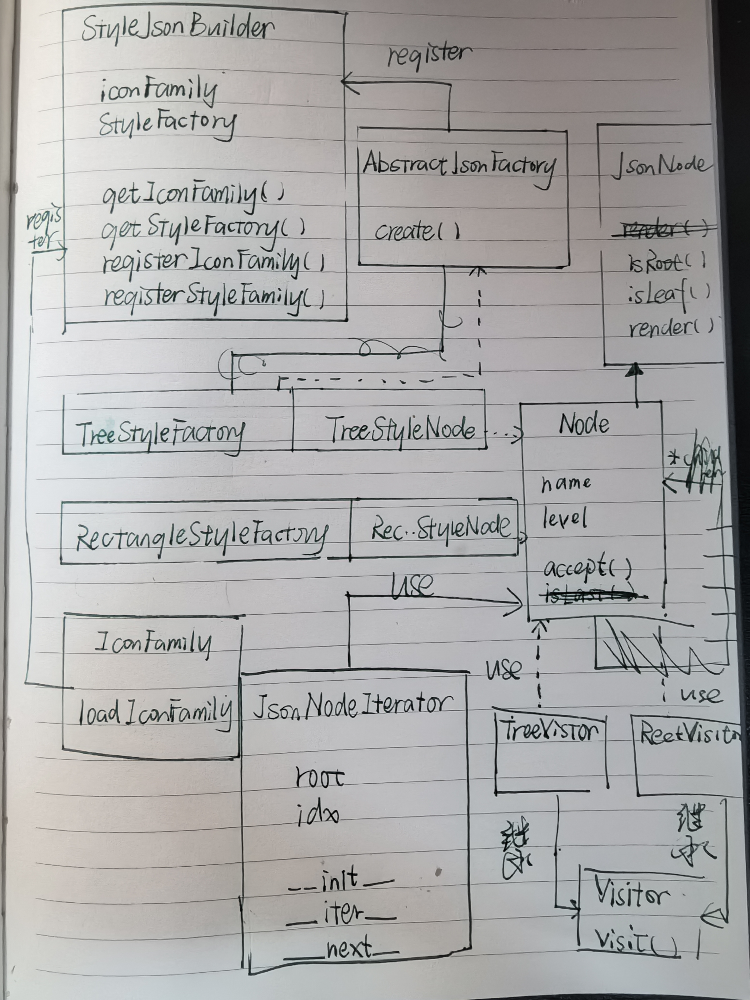
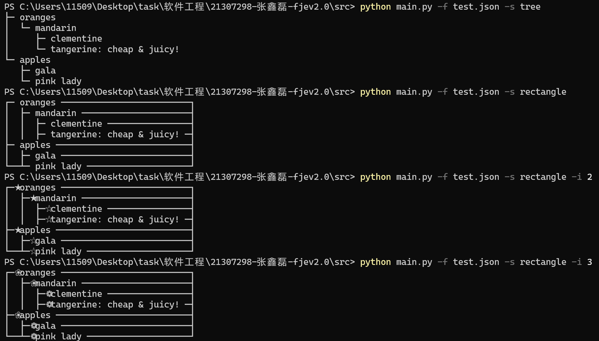

# 设计文档

## 代码结构

- AbstractFactory.py

- Builder.py

- Factory.py

- IconFamily.py

- JsonNode.py

- JsonNodeFactory.py

- Iterator.py 迭代器类

- Vistor.py 访问者类

## 类图



## 说明

在原本的类图中已经实现了JsonNode的container，因此迭代器只需要针对container设计即可。

python已经提供了迭代器接口，因此直接利用python提供的`__iter__`和`__next__`即可。

```python
class JsonNodeIterator:
    def __init__(self, root):
        self._root = root
        self._idx = 0

    def __iter__(self):
        return self

    def __next__(self):
        if self._idx >= len(self._root._children):
            raise StopIteration
        self._idx += 1
        return self._root._children[self._idx-1]
```

通过访问者模式封装对JsonNode的访问方式，对外提供visit()方法访问。

```python
class Visitor(ABC):
    @abstractmethod
    def visit(self, node, icon_family):
        pass

class TreeVisitor(Visitor):
    def visit(self, node, icon_family):
        node.render(icon_family)

class RectangleVisitor(Visitor):
    def visit(self, node, icon_family):
        node.render(icon_family)
```

更改main()方法

```python
def main():
    # 命令行工具
    parser = argparse.ArgumentParser(description='Funny JSON Explorer')
    parser.add_argument('-f', '--file', type=str, help='JSON file path', required=True)
    parser.add_argument('-s', '--style', type=str, help='style(tree or rectangle)', default='tree')
    parser.add_argument('-i', '--icon-family', type=str, help='icon family(1, 2 or 3)', default='1')
    # 设计模式：builder模式
    builder = Builder()
    root = builder(parser.parse_args().file)
    # 提出命令行信息
    icon_family = parser.parse_args().icon_family
    style = parser.parse_args().style
    # 设计模式：访问者模式
    if style == "tree":
        visitor = TreeDisplayVisitor()
    else if style == "rect":
        visitor = RectangleDisplayVisitor()
    # 设计模式：迭代器模式
    iterator = JsonNodeIterator(root)
    for node in iterator:
        node.accept(visitor, icon_family)
```

## 实验结果



## github链接

https://github.com/1150944612/fje